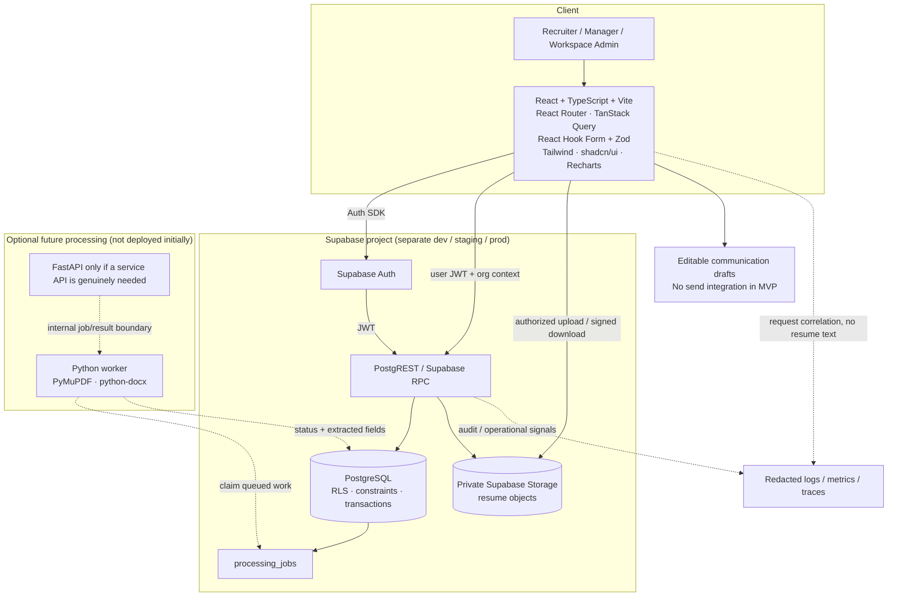

# SEARCHY — System Architecture Diagram

```mermaid
flowchart TB
  subgraph Client["Client"]
    Browser["Recruiter / Manager / Workspace Admin"]
    SPA["React + TypeScript + Vite\nReact Router · TanStack Query\nReact Hook Form + Zod\nTailwind · shadcn/ui · Recharts"]
    Browser --> SPA
  end

  subgraph Supabase["Supabase project (separate dev / staging / prod)"]
    Auth["Supabase Auth"]
    REST["PostgREST / Supabase RPC"]
    PG[("PostgreSQL\nRLS · constraints · transactions")]
    Bucket[("Private Supabase Storage\nresume objects")]
    Jobs["processing_jobs"]
    Auth -->|"JWT"| REST
    REST --> PG
    REST --> Bucket
    PG --> Jobs
  end

  SPA -->|"Auth SDK"| Auth
  SPA -->|"user JWT + org context"| REST
  SPA -->|"authorized upload / signed download"| Bucket

  subgraph Future["Optional future processing (not deployed initially)"]
    Worker["Python worker\nPyMuPDF · python-docx"]
    API["FastAPI only if a service API is genuinely needed"]
    Worker -. "claim queued work" .-> Jobs
    API -. "internal job/result boundary" .-> Worker
    Worker -. "status + extracted fields" .-> PG
  end

  Email["Editable communication drafts\nNo send integration in MVP"]
  Telemetry["Redacted logs / metrics / traces"]
  SPA --> Email
  SPA -. "request correlation, no resume text" .-> Telemetry
  REST -. "audit / operational signals" .-> Telemetry
```

MVP uses Supabase directly for app data and drafts. The future processing elements are optional extension points, not deployed dependencies.
